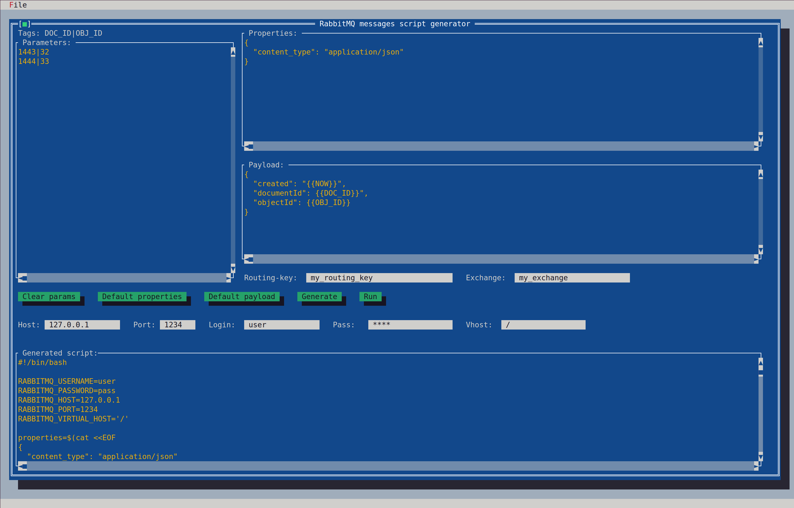
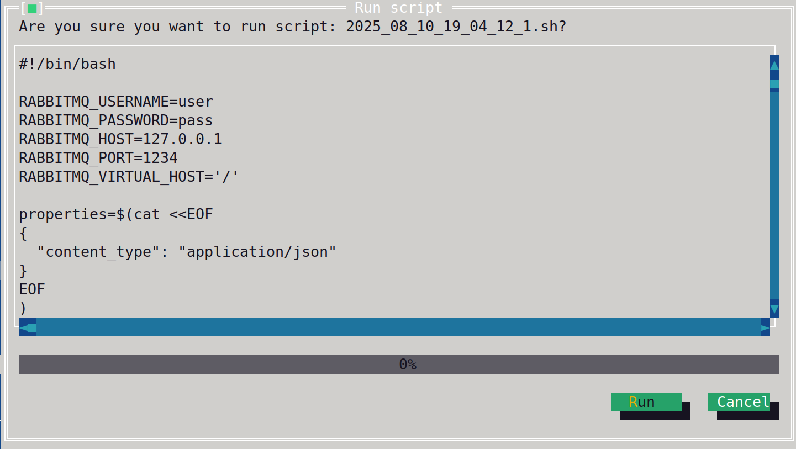

# rsender

rsender is a terminal UI (Turbo Vision) app for generating and running publish scripts for RabbitMQ. You provide a **template**, **parameters**, and **tags**; rsender expands placeholders into a batch of ready-to-send messages, shows detected tags, and lets you **save/open projects** and **run the script**.

## Features

* Editors for **Parameters**, **Properties**, **Payload**
* Live **tag detection**
* **Reserved tags** with auto-generated values: `{{RANDOM_UUID}}`, `{{NOW}}`
* **Routing key** and **Exchange** inputs
* RabbitMQ connection fields (**host, port, vhost, username, password**)
* **Generate** script, **Run** script, **Open/Save** project (`.json`)
* Project files stored under `rsender-data/projects`
* **Every generated script is saved to** `rsender-data/generated`

## Screenshots


*Main window with parameters, properties, payload, and tags.*


*Runner with progress.*

## Requirements

* C++17 toolchain (g++/clang++)
* [Turbo Vision (magiblot/tvision)](https://github.com/magiblot/tvision)
* CMake (recommended)
* Linux terminal

## Build

```bash
git clone <your-repo-url> rsender
cd rsender

cmake -B build -DCMAKE_BUILD_TYPE=Release
cmake --build ./build
```

## Usage

1. Fill **Parameters**: one line per message; values separated by | in the order of the detected tags shown (only detected tags are filled).
2. Fill **Properties**: JSON for message properties/headers (supports tags).
3. Fill **Payload**: JSON or text body (supports tags).
4. Set **Routing key** and **Exchange**.
5. Set **RabbitMQ** host/port/vhost/username/password.
6. Click **Generate** to build the script.
7. Click **Run** to execute/publish and view progress.
8. Use **File → Save/Open** for project files.

## Project Files (`.json`)

rsender saves projects as JSON in `rsender-data/projects`.

```json
{
  "exchange": "my_exchange",
  "host": "127.0.0.1",
  "params": "1443|32\r\n1444|33",
  "password": "pass",
  "payload": "{\n  \"created\": \"{{NOW}}\",\r\n  \"documentId\": {{DOC_ID}},\r\n  \"objectId\": {{OBJ_ID}}\n}",
  "port": "1234",
  "properties": "{\n  \"content_type\": \"application/json\"\n}",
  "routingKey": "my_routing_key",
  "username": "user",
  "vhost": "/"
}
```

> ⚠️ **Security**: Passwords are stored **in plain text**. Prefer throwaway creds or an external secret store.

## Templates & Tags

* Placeholders use `{{TAG_NAME}}` inside properties/payload.
* Built-ins commonly used:
    * `{{RANDOM_UUID}}` — generates a new UUID for each occurrence within a message
    * `{{NOW}}` — current timestamp (format: YYYY-MM-DDTHH:MM:SS.000), generates a new value for each message; repeated occurrences in the same message use the same value
* The tag list is shown live at the top of the main dialog.

## Example

**Parameters**

```
1443|32
1444|33
```

**Properties**

```json
{
  "content_type": "application/json"
}
```

**Payload**

```json
{
  "created": "{{NOW}}",
  "documentId": {{DOC_ID}},
  "objectId": {{OBJ_ID}}
}
```

**Generated script (snippet)**

```bash
#!/bin/bash

RABBITMQ_USERNAME=user
RABBITMQ_PASSWORD=pass
RABBITMQ_HOST=127.0.0.1
RABBITMQ_PORT=1234
RABBITMQ_VIRTUAL_HOST='/'

properties=$(cat <<EOF
{
  "content_type": "application/json"
}
EOF
)

payload=$(cat <<EOF
{
  "created": "2025-08-10T19:18:35.000",
  "documentId": 1443,
  "objectId": 32
}
EOF
)

./rabbitmqadmin.py -u"${RABBITMQ_USERNAME}" -p"${RABBITMQ_PASSWORD}" -H"${RABBITMQ_HOST}" -P"${RABBITMQ_PORT}" publish routing_key="my_routing_key" exchange=my_exchange properties="${properties}" payload="${payload}"
echo "Command executed (1)"

properties=$(cat <<EOF
{
  "content_type": "application/json"
}
EOF
)

payload=$(cat <<EOF
{
  "created": "2025-08-10T19:18:35.000",
  "documentId": 1444,
  "objectId": 33
}
EOF
)

./rabbitmqadmin.py -u"${RABBITMQ_USERNAME}" -p"${RABBITMQ_PASSWORD}" -H"${RABBITMQ_HOST}" -P"${RABBITMQ_PORT}" publish routing_key="my_routing_key" exchange=my_exchange properties="${properties}" payload="${payload}"
echo "Command executed (2)"


```

## Roadmap

### Windows version
* Native Windows build and UX parity with Linux.
* Cross-platform runner for the **Run** dialog without PTYs.

### Other
* Optional encrypted credential storage
* Custom tag functions (date formats, counters, etc.)

## Contributing

PRs and issues welcome. Please:

1. Open an issue to discuss changes.
2. Keep patches focused and tested.
3. Follow existing code style.

## License

MIT
